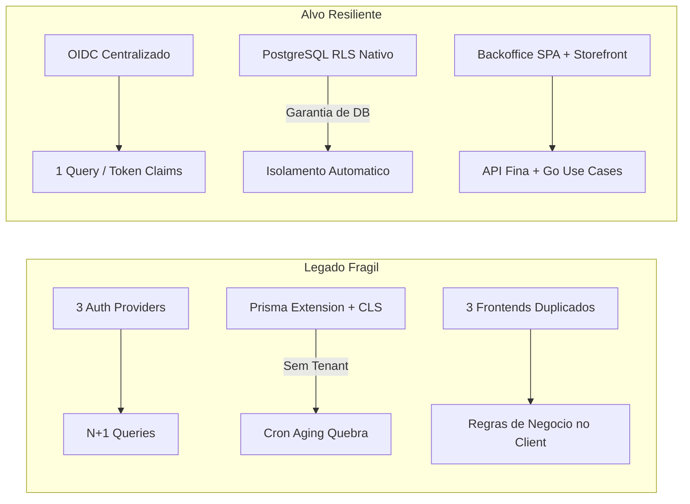
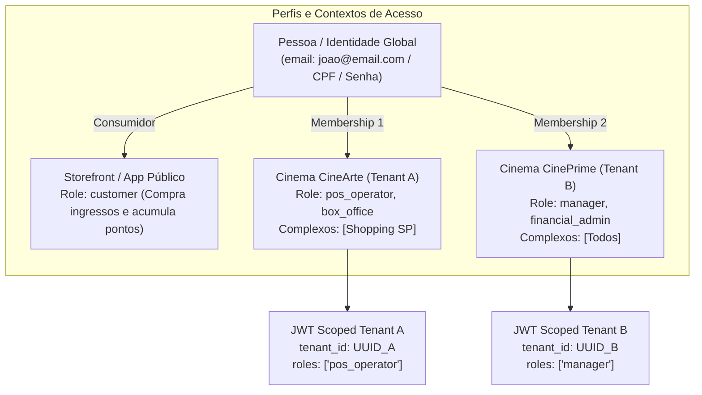
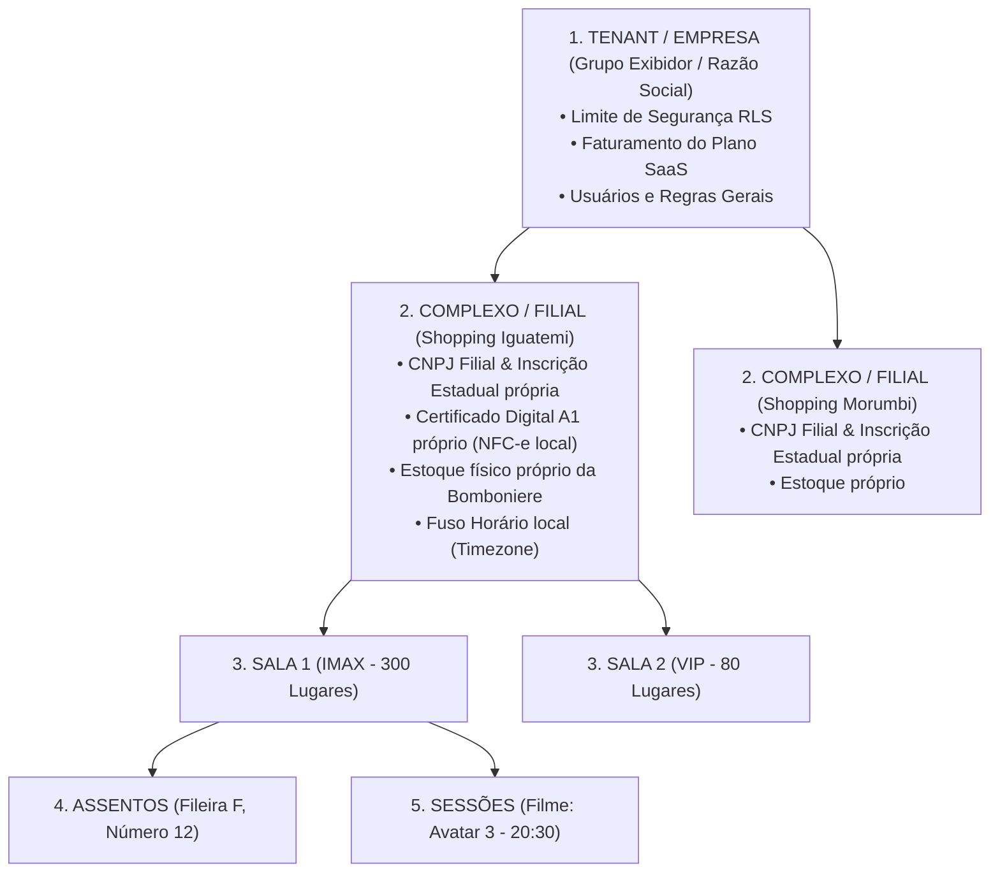
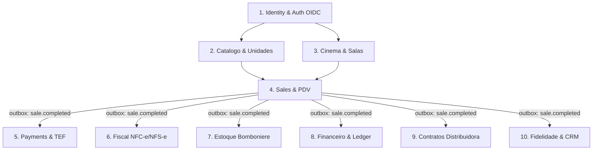
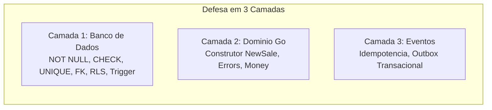
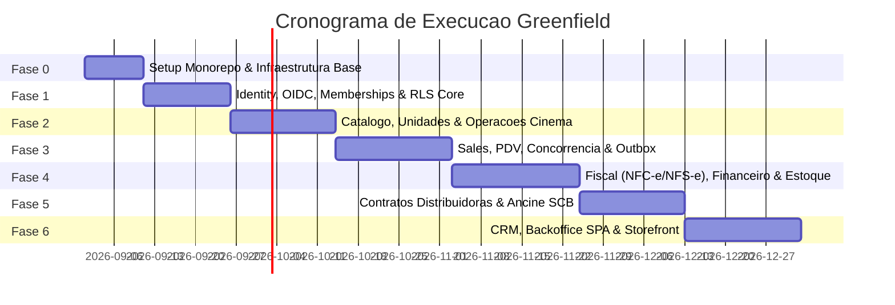

# Frame-24 — Documento de Arquitetura e Especificação Técnica (Master RFC)

> **Documento Oficial de Arquitetura de Referência para a Reescrita do Frame-24 em Go**  
> Modelo: Monólito Modular, Multi-tenant Nativo (RLS), Identidade Global com Multi-Membership, Event-Driven (Outbox), Contabilidade Double-Entry e Compliance Fiscal/Cinema.

**Status:** Aprovado para Implementação Greenfield  
**Versão:** 2.1.0  
**Última Atualização:** 2026-08-18  

---

## Sumário Geral

1. [Diagnóstico do Sistema Legado e Motivação](#1-diagnóstico-do-sistema-legado-e-motivação)
2. [Decisões Estratégicas de Stack e Arquitetura](#2-decisões-estratégicas-de-stack-e-arquitetura)
3. [Padrões de Engenharia e Arquitetura de Software](#3-padrões-de-engenharia-e-arquitetura-de-software)
4. [Identidade, Acesso e Hierarquia Multi-Tenant](#4-identidade-acesso-e-hierarquia-multi-tenant)
5. [Especificação dos Bounded Contexts (Domínios)](#5-especificação-dos-bounded-contexts-domínios)
6. [Regulação, Fiscal e Realidades do Setor de Cinema](#6-regulação-fiscal-e-realidades-do-setor-de-cinema)
7. [Infraestrutura, Performance e Observabilidade](#7-infraestrutura-performance-e-observabilidade)
8. [Qualidade: Estratégia de Testes e Catálogo de Invariantes](#8-qualidade-estratégia-de-testes-e-catálogo-de-invariantes)
9. [Vertical Slice de Referência em Go (Domínio Sales)](#9-vertical-slice-de-referência-em-go-domínio-sales)
10. [Roadmap de Execução Greenfield](#10-roadmap-de-execução-greenfield)

---

## 1. Diagnóstico do Sistema Legado e Motivação

O **Frame-24** foi concebido como um ERP e sistema de gestão integrada para redes e complexos de exibição cinematográfica no Brasil, cobrindo bilheteria, bomboniere (concessões), PDV, fiscal dual, financeiro contábil, CRM/fidelidade, gestão de estoque, contratos de distribuição com produtoras e projetos de incentivo RECINE.

### 1.1 Números Reais do Código Legado

| Dimensão | Métricas Extraídas do Repositório |
|---|---|
| **Backend API (NestJS 11)** | **57.000 linhas de código TypeScript, 535 arquivos, 233 rotas HTTP**, 17 módulos |
| **Banco de Dados (Prisma 7 / PostgreSQL)** | **15 schemas Postgres, ~100 modelos, 3.022 linhas de schema Prisma** |
| **Frontends (Next.js 16)** | 3 aplicações separadas (`web` ~15,8k LOC, `admin` ~8,2k LOC, `landing-page` ~1,5k LOC) |
| **Infraestrutura** | Postgres, Redis, RabbitMQ, MinIO, Mailpit, PgBouncer, Nginx (5 arquivos Compose) |
| **Cobertura de Testes** | 98 arquivos spec (~20% dos arquivos da API) |

---

### 1.2 Falhas Estruturais Críticas Confirmadas



1. **Multi-tenancy por Camada Mágica (CLS + Prisma Extension):**
   * A extensão `prisma-tenancy.extension.ts` depende do contexto de requisição HTTP (AsyncLocalStorage/CLS). 
   * **Falha Real:** O cron `aging-automation.service.ts` executa rotinas noturnas via `updateMany` em contas financeiras sem passar por middleware HTTP. O tenancy falha e lança exceções de runtime toda madrugada.
2. **Autenticação Tripla e Identidade Duplicada:**
   * Convivem três mecanismos: BetterAuth (sessões HTTP), `JwtAuthGuard` (lookup no banco com 3 tipos de usuário) e `jsonwebtoken` cru no gateway WebSocket de reserva de assentos.
   * Criação do hack de **e-mail alias** (`email__tenant__<slug>@...`) para contornar a unicidade global de e-mails em um sistema multi-tenant.
   * Resolução de usuário gera até 5 queries em cascata por requisição ($N+1$).
3. **Tipagem Poluída e Complexidade de Framework:**
   * Coexistência caótica de três sistemas de validação: `class-validator`, `zod` e DTOs manuais.
   * Empilhamento de decorators (Controller $\rightarrow$ Guard $\rightarrow$ Interceptor $\rightarrow$ Service $\rightarrow$ Repository $\rightarrow$ Prisma Transaction).
4. **Acoplamento e Código Morto:**
   * Módulos de infraestrutura e pacotes do monorepo declarados mas nunca usados (ex.: `@repo/ui`, `@repo/tailwind-config`).
   * Código de PDV duplicado entre `apps/web/src/app/pdv/page.tsx` (1.849 linhas) e `apps/admin/src/app/pos/*`.
   * Presença de subprojetos alienígenas órfãos (`mlops_project-main`).
5. **Falta de Versionamento Real de Schema:**
   * Uso de `prisma db push` com perda de dados aceita em scripts de deploy, sem rastreabilidade de migrações SQL.

---

### 1.3 Estratégia de Transição: Greenfield com Legado como Spec

O Frame-24 **não está em produção comercial ativa**. Portanto:
* **Não** se adota o *Strangler Pattern* (que adiciona custo de manter dois sistemas rodando em paralelo).
* Adota-se a **Reescrita Greenfield**: o código TypeScript atual deixa de ser mantido e passa a operar como a **Especificação de Domínio (Spec)**.
* As regras de negócio levantadas (fórmulas tributárias, lock de assentos em Lua, contratos de filmes) são extraídas, validadas e reescritas de ponta a ponta na nova arquitetura.

---

## 2. Decisões Estratégicas de Stack e Arquitetura

### 2.1 Comparação de Linguagens de Backend

| Linguagem | Tipagem & Robustez | Eficiência & Recursos | Simplicidade de Dev | Veredito |
|---|---|---|---|---|
| **Go** | **Forte, estática, sem `any` sorrateiro** | **Excepcional (binário estático ~25MB, heap < 30MB)** | **Alta (idiomático, sem mágica de reflexão, compilação instantânea)** | **Stack Escolhida** |
| **C# / .NET 9** | Excelente tipagem | Boa (CLR consome ~100MB) | Média (ecossistema corporativo robusto, mas mais verboso) | 2ª Opção |
| **Java 21 (Spring)** | Excelente tipagem | Pesado (JVM consome ~250MB+) | Baixa/Média (excesso de boilerplate e annotations mágicas) | Rejeitado para infra enxuta |
| **Rust (Axum)** | Máxima segurança | Máxima eficiência | Baixa (curva de aprendizado íngreme para ERP de negócio) | Rejeitado por custo de dev |
| **TypeScript / Node** | Poluída no runtime | Média/Baixa (V8 + Node modules) | Baixa com NestJS (decorators, tipagem descompassada) | Stack a ser abandonada |

---

### 2.2 Decisão Estrutural: Monólito Modular em Go (*Single Binary*)

Para garantir velocidade de entrega para uma equipe enxuta e viabilidade de deploy em servidores de baixo custo (VPS 512MB/1GB), **não** dividiremos o sistema em 10 microsserviços distribuídos em runtime. 

Adota-se o **Monólito Modular em Go**:
* **1 Único Binário em Produção:** Compilado via `go build -o frame24 ./cmd/server`.
* **Isolamento Estrito em Tempo de Compilação:** Cada bounded context vive em seu próprio pacote em `internal/<modulo>`. Um módulo não pode acessar diretamente tabelas ou repositórios de outro.
* **Comunicação Intra-processo:** Feita por interfaces Go fortemente tipadas para leitura e via **Transactional Outbox (PostgreSQL)** para eventos assíncronos de negócio.
* **Preparado para Separação Futura:** Se no futuro um módulo tiver demanda de escala desproporcional (ex.: `sales` na pré-venda de um filme concorrido), basta criar um `cmd/sales/main.go` importando `internal/sales` e subir como serviço isolado **sem alterar uma única linha da regra de negócio**.

```text
frame-24/
├── cmd/
│   ├── server/main.go          ← Ponto de entrada do Monólito Modular
│   └── migrate/main.go         ← CLI de execução de migrações SQL
├── internal/
│   ├── identity/               ← Bounded Context: OIDC, Usuários, Memberships, Tenants
│   ├── catalog/                ← Bounded Context: Filmes, Produtos, Unidades (CX/UN/KG)
│   ├── operations/             ← Bounded Context: Complexos, Salas, Sessões, Assentos
│   ├── sales/                  ← Bounded Context: Checkout, PDV, Reserva de Assentos
│   ├── fiscal/                 ← Bounded Context: NFC-e, NFS-e, Gateway Fiscal, Reforma Trib.
│   ├── finance/                ← Bounded Context: Ledger Double-Entry, Contas A Pagar/Receber
│   ├── contracts/              ← Bounded Context: Distribuidoras, Escalas, VPF, Ancine SCB
│   ├── crm/                    ← Bounded Context: Fidelidade, Clientes, Promoções
│   └── platform/               ← Shared: Postgres Pool, RLS Context, Outbox Engine, Auth
├── web/                        ← Aplicações Frontend Consolidadas
│   ├── backoffice/             ← SPA Vite + React 19 (Admin ERP + PDV Touch)
│   └── storefront/             ← Next.js / Astro (Venda Online Pública com SEO)
└── go.mod
```

---

### 2.3 Consolidação do Frontend

Os três frontends legados são reorganizados em **duas frentes especializadas**:

1. **`web/backoffice` (Vite + React 19 + TanStack Query + Tailwind + Shadcn UI):**
   * **Arquitetura SPA Client-Side pura:** Carregamento instantâneo, zero overhead de SSR no servidor.
   * **Módulo Administrativo ERP:** Gestão contábil, fiscal, contratos, RH e parametrização.
   * **PDV Integrado (Bilheteria + Concessão):** Interface otimizada para telas touch e atalhos rápidos de teclado (`F1-F12`), suporte a leitores de código de barras USB/Serial e balança digital.
   * **Portal de Suporte / Staff:** Capacidade de impersonação segura de tenants para atendimento.
2. **`web/storefront` (Next.js / Astro):**
   * Focado exclusivamente no consumidor final: programação de filmes, seleção visual de assentos em tempo real e checkout online.
   * Renderização com SSR/SSG para indexação perfeita em motores de busca (SEO).

---

## 3. Padrões de Engenharia e Arquitetura de Software

```text
┌───────────────────────────────────────────────────────────────────────────┐
│                           HTTP Router & Handlers                          │
│                (Parse DTO, Valida Tag, Extrai Tenant OIDC)                │
└─────────────────────────────────────┬─────────────────────────────────────┘
                                      │
                                      ▼
┌───────────────────────────────────────────────────────────────────────────┐
│                        Application Use Case (App)                         │
│         (Orquestra Transacao, Executa Regra, Publica Outbox)              │
└──────────────────┬─────────────────────────────────────┬──────────────────┘
                   │                                     │
                   ▼                                     ▼
┌─────────────────────────────────────┐   ┌─────────────────────────────────┐
│            Domain Core              │   │        Data Access (Repo)       │
│  (Entidades Puras, Errors, Money)   │   │  (Queries geradas via sqlc, tx) │
└─────────────────────────────────────┘   └─────────────────┬───────────────┘
                                                            │
                                                            ▼
                                          ┌─────────────────────────────────┐
                                          │      PostgreSQL (RLS Nativo)    │
                                          └─────────────────────────────────┘
```

### 3.1 Arquitetura Hexagonal por Módulo

Cada pacote em `internal/<modulo>` segue a separação estrita de responsabilidades:
* `domain/`: Modelos de dados puros, tipos de domínio (ex: `Money` como representação imutável de Decimal), invariantes e sentinelas de erro (`errors.go`). **Zero dependências externas.**
* `app/`: Casos de uso (comandos e queries). Orquestra transações de banco, invoca regras de domínio e grava eventos no Outbox.
* `http/`: Handlers HTTP finos, validação de payload via tags struct e roteamento Chi.
* `repo/`: Acesso a banco gerado via **`sqlc`**. Nenhuma query SQL manual espalhada pelo código.
* `db/`: Migrações versionadas (`migrations/*.sql`) e declarações de queries (`queries.sql`).

---

### 3.2 Acesso a Dados com `sqlc` e `golang-migrate`

Elimina-se o overhead de ORMs com reflexão em runtime. O desenvolvedor escreve SQL nativo compatível com PostgreSQL, e o `sqlc` compila o SQL em código Go fortemente tipado em tempo de compilação.

```sql
-- internal/operations/db/queries.sql
-- name: GetShowtimeForBooking :one
SELECT 
    s.id, s.room_id, s.movie_id, s.start_time, s.base_price,
    r.name AS room_name, r.capacity AS room_capacity,
    m.title AS movie_title
FROM operations.showtimes s
JOIN operations.rooms r ON r.id = s.room_id
JOIN catalog.movies m ON m.id = s.movie_id
WHERE s.id = $1 AND s.tenant_id = current_tenant();
```

---

### 3.3 Multi-Tenancy Nativo com PostgreSQL Row-Level Security (RLS)

O isolamento de dados é delegado diretamente ao motor do PostgreSQL através de **Row-Level Security**, eliminando de forma definitiva a possibilidade de vazamento de dados entre empresas por esquecimento de cláusula `WHERE tenant_id = ...`.

#### Função de Contexto de Tenant e Proteção
```sql
-- migration: 0001_setup_rls.sql
CREATE OR REPLACE FUNCTION current_tenant() RETURNS uuid AS $$
BEGIN
    RETURN NULLIF(current_setting('app.tenant_id', true), '')::uuid;
EXCEPTION
    WHEN OTHERS THEN
        RAISE EXCEPTION 'Operacao abortada: contexto de tenant nao definido na transacao!';
END;
$$ LANGUAGE plpgsql STABLE;
```

#### Aplicação das Políticas RLS
```sql
ALTER TABLE sales.sales ENABLE ROW LEVEL SECURITY;
ALTER TABLE sales.sales FORCE ROW LEVEL SECURITY;

CREATE POLICY sales_isolation_policy ON sales.sales
    AS RESTRICTIVE
    USING (tenant_id = current_tenant())
    WITH CHECK (tenant_id = current_tenant());
```

#### Padrão de Execução no Código Go (`platform/db`)
Para conexões gerenciadas em pool (`pgxpool`), a injeção do tenant é feita **sempre em escopo transacional (`SET LOCAL`)**:

```go
func RunInTenantTx(ctx context.Context, pool *pgxpool.Pool, tenantID uuid.UUID, fn func(tx pgx.Tx) error) error {
    tx, err := pool.Begin(ctx)
    if err != nil {
        return err
    }
    defer tx.Rollback(ctx)

    // SET LOCAL restringe o tenant estritamente a esta transacao no pool
    _, err = tx.Exec(ctx, "SELECT set_config('app.tenant_id', $1, true)", tenantID.String())
    if err != nil {
        return fmt.Errorf("falha ao definir contexto de tenant: %w", err)
    }

    if err := fn(tx); err != nil {
        return err
    }

    return tx.Commit(ctx)
}
```

---

### 3.4 Barramento de Eventos e Transactional Outbox Pattern Lean

A comunicação assíncrona entre módulos (ex.: *Venda Concluída* $\rightarrow$ *Baixa no Estoque*, *Lançamento Contábil* e *Emissão Fiscal*) utiliza a tabela `outbox_events` gravada na **mesma transação ACID da operação de negócio**.

```sql
CREATE TABLE platform.outbox_events (
    id           uuid PRIMARY KEY DEFAULT gen_random_uuid(),
    tenant_id    uuid NOT NULL,
    event_type   text NOT NULL,
    aggregate_id uuid NOT NULL,
    payload      jsonb NOT NULL,
    status       text NOT NULL DEFAULT 'pending', -- pending | processed | failed
    retry_count  int NOT NULL DEFAULT 0,
    created_at   timestamptz NOT NULL DEFAULT now(),
    processed_at timestamptz
);

CREATE INDEX idx_outbox_pending ON platform.outbox_events (status, created_at) WHERE status = 'pending';
```

#### Dispatcher em Go (Zero Infraestrutura Extra)
Uma goroutine interna consome os eventos pendentes com concorrência segura utilizando `FOR UPDATE SKIP LOCKED`, garantindo processamento *at-least-once* sem necessidade obrigatória de brokers externos na VPS enxuta:

```sql
-- Worker query
SELECT id, tenant_id, event_type, payload
FROM platform.outbox_events
WHERE status = 'pending' AND retry_count < 5
ORDER BY created_at ASC
LIMIT 50
FOR UPDATE SKIP LOCKED;
```

---

### 3.5 Contabilidade com Ledger Double-Entry Imutável

Dinheiro no Frame-24 não é um campo numérico solto que sofre mutação. Toda movimentação financeira gera um par equilibrado de débito e crédito imutável.

```sql
CREATE TABLE finance.ledger_entries (
    id             uuid PRIMARY KEY DEFAULT gen_random_uuid(),
    tenant_id      uuid NOT NULL,
    transaction_id uuid NOT NULL,
    account_id     uuid NOT NULL REFERENCES finance.accounts(id),
    entry_type     text NOT NULL, -- DEBIT | CREDIT
    amount         numeric(12,2) NOT NULL CHECK (amount > 0),
    description    text NOT NULL,
    created_at     timestamptz NOT NULL DEFAULT now()
);

-- Constraint de balanceamento via trigger no fechamento do lote:
-- SUM(DEBIT) - SUM(CREDIT) = 0
```

---

## 4. Identidade, Acesso e Hierarquia Multi-Tenant

Para eliminar em definitivo os problemas legados de autenticação tripla, $N+1$ na resolução de usuário e o hack de e-mail alias, o Frame-24 divide a camada de identidade em **Identidade Global (A Pessoa)** e **Membro de Tenant / Papel (O Vínculo de Trabalho)**.



---

### 4.1 Modelagem de Identidade no SQL

```sql
CREATE SCHEMA identity;

-- 1. Identidade Global (A Pessoa Fisiológica)
CREATE TABLE identity.users (
    id            uuid PRIMARY KEY DEFAULT gen_random_uuid(),
    email         text NOT NULL UNIQUE,       -- E-mail e unico NO SISTEMA INTEIRO
    cpf           text UNIQUE,                -- Opcional (para fiscal / meia-entrada)
    password_hash text NOT NULL,
    full_name     text NOT NULL,
    phone         text,
    is_active     boolean NOT NULL DEFAULT true,
    mfa_secret    text,
    created_at    timestamptz NOT NULL DEFAULT now()
);

-- 2. Vínculo de Trabalho com Empresas (Multi-Tenant Membership)
CREATE TABLE identity.tenant_memberships (
    id          uuid PRIMARY KEY DEFAULT gen_random_uuid(),
    user_id     uuid NOT NULL REFERENCES identity.users(id) ON DELETE CASCADE,
    tenant_id   uuid NOT NULL REFERENCES identity.tenants(id) ON DELETE CASCADE,
    roles       text[] NOT NULL,              -- ['pos_operator', 'financial_manager', 'admin']
    complex_ids uuid[],                       -- NULL = Todos os cinemas da rede; ou ['uuid-cinema-sp']
    is_active   boolean NOT NULL DEFAULT true,
    created_at  timestamptz NOT NULL DEFAULT now(),
    UNIQUE(user_id, tenant_id)                -- 1 vinculo por empresa
);

-- 3. Perfil de Consumidor (Fidelidade por Cinema)
CREATE TABLE crm.customer_profiles (
    id          uuid PRIMARY KEY DEFAULT gen_random_uuid(),
    tenant_id   uuid NOT NULL,
    user_id     uuid NOT NULL REFERENCES identity.users(id) ON DELETE CASCADE,
    loyalty_pts int NOT NULL DEFAULT 0,
    created_at  timestamptz NOT NULL DEFAULT now(),
    UNIQUE(tenant_id, user_id)
);
```

---

### 4.2 Fluxo de Login e Tenant Switcher

1. **Consumidor Final (Storefront Público):**
   * O cliente loga no site/app do cinema (`cinearte.frame24.com.br`).
   * A API identifica o `tenant_id` pelo host/subdomínio e emite um JWT com `role: "customer"` e `tenant_id`.
2. **Funcionário com Múltiplos Vínculos (Backoffice):**
   * O funcionário acessa `admin.frame24.com.br` com seu e-mail e senha globais.
   * Se possuir vínculo com apenas 1 empresa, recebe o token diretamente.
   * Se possuir vínculo com 2 ou mais empresas (ex.: Operador no CineArte e Gerente no CinePrime), o frontend exibe o **Seletor de Empresa (*Tenant Switcher*)**.
   * Ao selecionar, a API emite o JWT assinado correspondente:
     ```json
     {
       "sub": "usr_9988aabb",
       "name": "João da Silva",
       "tenant_id": "ten_cinearte_1122",
       "roles": ["pos_operator"],
       "complex_ids": ["cmp_sp_iguatemi_33"]
     }
     ```
   * O usuário pode alternar de empresa a qualquer momento pelo header do Backoffice sem refazer login.

---

### 4.3 Hierarquia Física do Cinema no SQL (Rede vs Complexo vs Salas)

A hierarquia física e contábil do cinema é estritamente modelada no banco:



```sql
CREATE SCHEMA operations;

-- Nível 1: Complexo Físico (Filial)
CREATE TABLE operations.cinema_complexes (
    id                     uuid PRIMARY KEY DEFAULT gen_random_uuid(),
    tenant_id              uuid NOT NULL,
    name                   text NOT NULL,               -- "CineArte Shopping Iguatemi"
    cnpj                   text NOT NULL,               -- CNPJ da Filial
    state_registration     text,                        -- IE local para NFC-e
    municipal_registration text,                        -- IM local para NFS-e
    timezone               text NOT NULL DEFAULT 'America/Sao_Paulo', -- Fuso horario IANA local
    ancine_complex_code    text,                        -- Codigo do complexo na Ancine
    created_at             timestamptz NOT NULL DEFAULT now()
);

-- Nível 2: Salas do Complexo
CREATE TABLE operations.rooms (
    id                  uuid PRIMARY KEY DEFAULT gen_random_uuid(),
    tenant_id           uuid NOT NULL,
    complex_id          uuid NOT NULL REFERENCES operations.cinema_complexes(id) ON DELETE CASCADE,
    name                text NOT NULL,                  -- "Sala 1 - IMAX"
    capacity            int NOT NULL CHECK (capacity > 0),
    ancine_room_code    text,
    created_at          timestamptz NOT NULL DEFAULT now()
);

-- Nível 3: Sessões Agendadas (Horários em UTC + Contexto Local)
CREATE TABLE operations.showtimes (
    id                  uuid PRIMARY KEY DEFAULT gen_random_uuid(),
    tenant_id           uuid NOT NULL,
    complex_id          uuid NOT NULL REFERENCES operations.cinema_complexes(id),
    room_id             uuid NOT NULL REFERENCES operations.rooms(id) ON DELETE CASCADE,
    movie_id            uuid NOT NULL,
    start_time          timestamptz NOT NULL,           -- Sempre armazenado em UTC
    end_time            timestamptz NOT NULL,
    base_ticket_price   numeric(10,2) NOT NULL,
    status              text NOT NULL DEFAULT 'scheduled',
    created_at          timestamptz NOT NULL DEFAULT now()
);
```

---

### 4.4 Portabilidade e Exportação de Dados por Tenant (Offboarding)

Se um cinema rescindir contrato ou solicitar seus dados para migração/compliance LGPD:
1. **Comando de Exportação Automatizado:**
   ```bash
   frame24 export-tenant --tenant-id=<UUID> --output=tar.gz
   ```
2. **Extração Determinística:**
   * Extração de todas as tabelas via `COPY (SELECT * FROM <table> WHERE tenant_id = $1) TO STDOUT WITH CSV HEADER`.
   * Coleta de todos os arquivos XML de notas fiscais autorizadas e PDFs de contratos sob `tenants/<tenant_id>/` no S3/MinIO.
3. **Entrega de Pacote Criptografado:**
   * Gera um arquivo `export_<tenant_slug>_<data>.tar.gz` contendo dumps SQL estruturados, planilhas CSV e XMLs fiscais, disponibilizado via link assinado com expiração em 48h.

---

## 5. Especificação dos Bounded Contexts (Domínios)



### 5.1 `identity` (Identidade e Acesso)
* **Responsabilidade:** Provedor OIDC, autenticação unificada, gestão de tenants, usuários, memberships e papéis (RBAC/ABAC).
* **Claims:** O token JWT contém `tenant_id`, `user_id`, `roles` e lista de `complex_ids` autorizados para o operador.

---

### 5.2 `catalog` (Catálogo e Unidades de Medida)
* **Responsabilidade:** Filmes, produtos de bomboniere, combos dinâmicos e precificação.
* **Modelo Wintor de Unidades e Códigos de Barra:**
  * Permite compra em Caixa (`CX`) e venda em Unidade (`UN`) com fator de conversão automático.
  * Suporte a múltiplos códigos de barras (EAN da caixa diferente do EAN da unidade).
  * Suporte a itens pesáveis a granel (`KG` / `G`) com leitura de balança.

```sql
CREATE TABLE catalog.product_units (
    id          uuid PRIMARY KEY DEFAULT gen_random_uuid(),
    tenant_id   uuid NOT NULL,
    product_id  uuid NOT NULL REFERENCES catalog.products(id) ON DELETE CASCADE,
    unit_code   text NOT NULL, -- UN, CX, KG, LT, G
    factor      numeric(12,4) NOT NULL DEFAULT 1.0, -- Ex: 1 CX = 24 UN -> factor = 24.0
    is_base     boolean NOT NULL DEFAULT false,     -- Estoque mantido sempre na unidade base
    sellable    boolean NOT NULL DEFAULT true
);

CREATE TABLE catalog.product_barcodes (
    id         uuid PRIMARY KEY DEFAULT gen_random_uuid(),
    tenant_id  uuid NOT NULL,
    unit_id    uuid NOT NULL REFERENCES catalog.product_units(id) ON DELETE CASCADE,
    barcode    text NOT NULL,
    UNIQUE(tenant_id, barcode)
);
```

---

### 5.3 `operations` (Cinema e Programação)
* **Responsabilidade:** Cadastro de complexos físicos, salas, mapas de assento (convencionais, VIP, D-BOX, cadeirantes, obesos) e grade de programação de sessões.
* **Gestão de Timezone:** Todo complexo armazena seu fuso horário oficial; conversão para visualização de bilheteria e emissão de ingressos no horário local.
* **Invariante de Sala:** Conflito de horários de sessões na mesma sala impedido nativamente no banco por constraint de exclusão (`EXCLUDE USING gist`).

---

### 5.4 `sales` (Bilheteria, PDV e Reserva de Assentos)
* **Responsabilidade:** Carrinho de compras unificado (ingressos + bomboniere), motor de reserva de assentos em tempo real e PDV touch.
* **Lock de Assentos Atômico (Redis + Script Lua):**
  * Script Lua atômico com tempo de execução $< 1\text{ms}$, eliminando concorrência e *deadlocks* no banco de dados durante abertura de vendas de blockbusters:
    ```lua
    local showtime = KEYS[1]
    local seat = ARGV[1]
    local user = ARGV[2]
    local ttl = ARGV[3]

    local current = redis.call('GET', showtime .. ':' .. seat)
    if current and current ~= user then
        return 0 -- Assento ja reservado por outro cliente
    end

    redis.call('SET', showtime .. ':' .. seat, user, 'EX', ttl)
    return 1 -- Lock concedido
    ```
  * Hold de 5 minutos com heartbeat de renovação no checkout e broadcast WebSocket para atualização de mapa nos clientes.
* **Cota Legal de Meia-Entrada (Lei Federal 12.933/2013):**
  * Validação no caso de uso: trava a emissão de ingressos com benefício de meia-entrada quando atingir 40% da capacidade total da sala para a sessão.

---

### 5.5 `payments` (Pagamentos e TEF)
* **Responsabilidade:** Pagamentos online (PIX imediato via BACEN, Cartão de Crédito) e pagamentos presenciais via **TEF Integrado (PinPad)**.
* **Idempotência Estrita:** Registro prévio de chave de idempotência; retentativas ou webhooks duplicados são no-ops imediatos.
* **Adapter TEF:** Integração com discadores TEF (Cielo, Stone, Rede, Sitef) para conciliação física automática com o fechamento do caixa no PDV.

---

### 5.6 `inventory` (Estoque de Bomboniere)
* **Responsabilidade:** Controle de saldo físico e custo médio ponderado.
* **Movimentação Append-Only:** Não existe `UPDATE` em estoque. Toda alteração é um registro de `inventory_movements` (Venda, Entrada por NF, Perda/Descarte, Ajuste de Inventário).
* **Estoque em Unidade Base:** Toda baixa por venda de combo ou unidade desconverte proporcionalmente na unidade base física.

---

### 5.7 `finance` (Financeiro, Fechamento de Caixa e Ledger)
* **Responsabilidade:** Contas a Pagar/Receber, Ledger Geral Double-Entry e gestão de caixas de PDV.
* **Operação de PDV Seguro:**
  * **Abertura de Caixa & Suprimento (Troco inicial);**
  * **Sangrias:** Retiradas periódicas de dinheiro para o cofre com impressão de recibo;
  * **Fechamento Cego de Caixa (*Blind Close*):** Ao encerrar o turno, o operador conta e digita os valores sem ver o saldo esperado pelo sistema. O sistema compara, gera o borderô de conferência para o gerente e registra diferenças contábeis no Ledger.

---

### 5.8 `contracts` (Licenciamento de Filmes e Distribuidoras)
* **Responsabilidade:** Gestão dos acordos de exibição cinematográfica com distribuidoras (Disney, Warner, Universal, Paris Filmes, etc.).
* **Escalas Deslizantes (*Sliding Scales*):** Percentual do exibidor vs distribuidora variável por semana de exibição (ex.: Semana 1: 55% distribuidora / 45% exibidor; Semana 4: 40% distribuidora / 60% exibidor).
* **Garantia Mínima (MG):** Controle de adiantamentos pagos que são amortizados na prestação de contas.
* **VPF (Virtual Print Fee):** Taxa devida pela distribuidora ao exibidor pelo uso dos projetores digitais por sessão.
* **Prestação de Contas (*Settlement*):** Emissão automática do borderô oficial com apuração líquida devida.

---

### 5.9 `crm` & `marketing` (Fidelidade e Promoções)
* **Responsabilidade:** Cadastro unificado de clientes, histórico de consumo, pontuação de fidelidade (*Cinema Club*), cashback, cupons e regras de bomboniere.

---

## 6. Regulação, Fiscal e Realidades do Setor de Cinema

```text
                                  ┌────────────────────────┐
                                  │      Venda Emitida     │
                                  └───────────┬────────────┘
                                              │
                     ┌────────────────────────┴────────────────────────┐
                     │                                                 │
                     ▼                                                 ▼
        ┌─────────────────────────┐                       ┌─────────────────────────┐
        │  Ingressos (LC 116/03)  │                       │  Bomboniere (Mercadoria)│
        │       ISS / NFS-e       │                       │       ICMS / NFC-e      │
        └────────────┬────────────┘                       └────────────┬────────────┘
                     │                                                 │
                     └────────────────────────┬────────────────────────┘
                                              │
                                              ▼
                             ┌──────────────────────────────────┐
                             │    Motor Fiscal (Regras por      │
                             │     Vigencia: CBS/IBS 2026+)     │
                             └────────────────┬─────────────────┘
                                              │
                                              ▼
                             ┌──────────────────────────────────┐
                             │ Gateway Fiscal (Emissao Assinc)  │
                             └──────────────────────────────────┘
```

### 6.1 Dualidade Fiscal Obrigatória no Cinema Brasileiro

No Brasil, uma única compra de cinema possui naturezas jurídicas e tributárias completamente distintas:

| Operação | Natureza | Tributo Vigente | Tributo Reforma (2027+) | Documento Fiscal Emitido |
|---|---|---|---|---|
| **Ingresso de Cinema** | Serviço de Exibição (Item 13.02 LC 116/03) | **ISS** Municipal | **IBS** Municipal/Estadual + **CBS** | **NFS-e** ou Cupom de Bilheteria homologado |
| **Bomboniere (Pipoca, Bebidas)** | Venda de Mercadoria | **ICMS** Estadual (+ PIS/COFINS) | **IBS** Estadual + **CBS** | **NFC-e** (ou SAT/CF-e em SP) |
| **Venda Corporativa (PJ)** | Pacote de Sessão Fechada | ISS + ICMS | IBS + CBS | **NF-e** Modelo 55 |

---

### 6.2 Cancelamento de NFC-e e Estornos Legais

Devido ao prazo regulatório limite da SEFAZ de 30 minutos para cancelamento direto de NFC-e:
* **Cancelamento $\le 30$ minutos:** O sistema envia evento de cancelamento direto da NFC-e para a SEFAZ via Gateway.
* **Cancelamento $> 30$ minutos (ou troca de sessão/devolução):** O sistema emite automaticamente uma **NF-e de Devolução/Estorno de Entrada** (CFOP 1.202/2.202) para anular o débito de ICMS de forma 100% legal perante o Fisco, estornando o lançamento contábil no Ledger.

---

### 6.3 Reforma Tributária do Consumo (LC 214/2025) e RECINE

O módulo `fiscal` do Frame-24 nasce preparado para o período de transição tributária brasileiro:
* **2026 (Fase de Teste):** Destaque de CBS (0,9%) e IBS (0,1%) nas notas sem cobrança efetiva (layout NT 2025.002).
* **2027 (Entrada em Vigor CBS):** Extinção do PIS/COFINS. Entrada da CBS plena. Suporte a **Split Payment** automático no checkout e opção de **Simples Híbrido** no cadastro do cinema.
* **2029–2032:** Transição gradual do ICMS/ISS para o IBS.
* **RECINE (Lei 15.132/2025):** Benefício fiscal prorrogado até 31/12/2029 para modernização de salas de cinema. As regras de isenção são parametrizadas por vigência.

---

### 6.4 Integração Obrigatória com o SCB da Ancine (IN 86/102)

Todo exibidor comercial no Brasil é obrigado a reportar suas sessões e bilheterias para a Ancine:
* O módulo `contracts` consolida diariamente: Registro do Complexo na Ancine, Registro da Sala, Código ANCINE/SALIC do Filme (CPB / CRT), número de pagantes, meias-entradas, cortesias e renda bruta.
* Gera e transmite os lotes diários nos padrões e layouts exigidos pela Ancine.

---

### 6.5 Resiliência e Operação do PDV em Contingência (Offline First)

1. **Modo Contingência no PDV:** O PDV do Backoffice opera com cache local (IndexedDB).
2. **Bomboniere Offline:** Vende itens com base no catálogo cacheado localmente.
3. **Bilheteria Offline:** Emite ingressos a partir de um lote de contingência pré-alocado.
4. **NFC-e em Contingência:** Emissão com flag de contingência offline (SEFAZ TP_EMIS = 9) para impressão imediata do DANFE ao cliente.
5. **Sincronização:** Ao restabelecer a conexão, o PDV descarrega o lote de vendas na API com chave de idempotência; a API processa o Outbox e transmite as notas fiscais pendentes.

---

### 6.6 Posicionamento Competitivo e Modelo Comercial

* **SaaS All-in-One por Assinatura (MRR):** O exibidor paga mensalidade pelo software (base + por sala) e retém **100% da receita da venda online** (sem cobrança de comissão sobre ingressos, diferente de CineSis e Ingresso.com).
* **ERP Real:** Integra contratos complexos de distribuição, escalas deslizantes, VPF, contabilidade double-entry e emissão fiscal completa na mesma plataforma unificada.

---

## 7. Infraestrutura, Performance e Observabilidade

### 7.1 Topologia Lean de Produção (VPS 512MB / 1GB)

O sistema foi desenhado para rodar completo em servidores enxutos sem estourar memória:

| Componente | Implementação Escolhida | Consumo Estimado de Memória |
|---|---|---|
| **Backend API + Workers** | **1 Binário Go compilado (`frame24`)** | **~25 MB a 40 MB** |
| **Banco de Dados** | **PostgreSQL 16/17 (configuração ajustada)** | **~150 MB a 200 MB** |
| **Cache & Locks de Assento** | **Redis 7 Alpine** | **~25 MB a 35 MB** |
| **Fila de Eventos** | **Postgres Outbox Engine (SKIP LOCKED)** | **+0 MB (incluso no Postgres)** |
| **Gateway & TLS** | **Nginx** | **~10 MB** |
| **Armazenamento de XML/Mídia** | **Disco Local (Adapter S3 compatível)** | **~0 MB** |
| **Total da Stack** | | **~220 MB a 285 MB** (Roda com folga em VPS 512MB/1GB) |

---

### 7.2 Caminho de Escala Progressiva

A arquitetura escala por configuração e infraestrutura, **sem necessidade de refatorar código**:
1. **Fase 1 (Single VPS):** 1 VPS (1-2GB RAM) com App Go + Postgres + Redis + Nginx.
2. **Fase 2 (Crescimento de Tenants):** Separação do PostgreSQL em instância gerenciada dedicada + introdução de **PgBouncer** em modo transação.
3. **Fase 3 (Alta Carga de Eventos):** Ativação do adapter NATS para distribuição de eventos do Outbox entre múltiplos nós de workers.
4. **Fase 4 (Mídia e Arquivos):** Troca do adapter de disco local para AWS S3 ou Cloudflare R2 via variável de ambiente.

---

### 7.3 Observabilidade Integrada

* **Logs Estruturados:** Formato JSON nativo com `log/slog`, enriquecido com `tenant_id`, `user_id`, `request_id` e `trace_id`.
* **Métricas:** Exportador Prometheus em `/metrics` expondo latência de handlers, taxa de checkout, erros 4xx/5xx e profundidade da fila outbox.
* **Health Checks:** Endpoints padronizados `/healthz/live` e `/healthz/ready` checando conectividade com banco de dados e Redis.

---

### 7.4 Documentação Viva Code-First

* **Structs Go são a Fonte Única da Verdade:** Tags de validação (`validate:"required"`) e anotações geram automaticamente o arquivo `openapi.json`.
* **Swagger UI Nativo:** Servido diretamente na rota `/swagger` em ambiente de desenvolvimento.

---

## 8. Qualidade: Estratégia de Testes e Catálogo de Invariantes

### 8.1 Pirâmide de Testes para ERP de Negócio

```text
                  ▲
                 / \
                /E2E\             ← Poucos: Venda Completa -> Pagamento -> Fiscal
               /-----\
              / Contrato\         ← Medios: Handlers HTTP + Validacao DTO (httptest)
             /-----------\
            /  Integracao \       ← CRITICOS: Queries sob RLS real (testcontainers-go)
           /---------------\
          /   Unidade Pura  \     ← MAIORIA: Regras de Dominio, Money, Tax, Calculos
         /───────────────────\
```

* **Testes de Integração com Banco Real:** Uso de `testcontainers-go` para subir instâncias reais do PostgreSQL no CI. Nenhuma query SQL ou política RLS vai para produção sem teste de integração real.
* **Execução Contínua com Detector de Concorrência:** `go test -race ./...` obrigatório no pipeline de CI/CD.
* **Metas Estritas de Cobertura:** Módulos críticos (`finance`, `fiscal`, `sales`, `identity`): **mínimo de 90%**.

---

### 8.2 Catálogo Geral de Invariantes por Módulo



| Domínio | Regra Inviolável (Invariante) | Camada de Defesa Primária | Comportamento em Caso de Violação |
|---|---|---|---|
| **Identity** | Pelo menos 1 usuário Administrador ativo por Tenant | Trigger / Check no Banco + Use Case | Operação rejeitada com HTTP 422; impede trancamento do tenant |
| **Identity** | E-mail globalmente único na tabela `users` | `UNIQUE(email)` no PostgreSQL | HTTP 409 Conflict |
| **Operations** | Duas sessões não podem sobrepor horário na mesma sala | Constraint `EXCLUDE USING gist` | INSERT abortado no banco mesmo sob concorrência |
| **Operations** | Complexo possui fuso horário IANA válido | Validação de Domínio no Cadastro | Erro HTTP 422 se o timezone não for reconhecido |
| **Sales** | Valor total da venda = Soma exata dos itens (ingressos + bomboniere) | Trigger de integridade no commit da venda | Transação abortada; evento `sale.completed` não é gerado |
| **Sales** | Um assento nunca pode ser vendido ou reservado 2x | Lock Redis/Lua + `UNIQUE(showtime_id, seat_id)` | Retorna `ErrSeatUnavailable` (HTTP 409) |
| **Sales** | Vendas de Meia-Entrada $\le 40\%$ da capacidade da sessão | Use Case de Reserva + Validação de cota | Retorna `ErrHalfPriceQuotaExceeded` (HTTP 422) |
| **Finance** | Double-Entry equilibrado: $\sum Débitos = \sum Créditos$ por lançamento | Trigger contábil na tabela `ledger_entries` | Lote rejeitado se a diferença for $\neq 0$ |
| **Finance** | Fechamento cego de caixa não revela saldo ao operador | Domain Service de Caixa (Blind Close) | Saldo do sistema só é visível para o perfil de Gerente |
| **Fiscal** | Cancelamento $> 30$ min de NFC-e gera NF-e de devolução | Domain State Machine Fiscal | Impede rejeição da SEFAZ e emite documento correto |
| **Inventory** | Saldo físico de estoque disponível nunca pode ser negativo | `CHECK (quantity >= 0)` no saldo físico | Baixa rejeitada; venda bloqueada por falta de estoque |
| **Contracts** | Soma dos percentuais de contrato: $\%$ Exibidor $+$ $\%$ Distribuidora $= 100\%$ | `CHECK (exhibitor_pct + distributor_pct = 100)` | Contrato rejeitado com HTTP 422 |
| **Tenancy** | Nenhuma operação pode executar sem `tenant_id` ativo | RLS `FORCE` + `current_tenant()` abortando se nulo | Erro imediato de SQL; isolamento total garantido |
| **Técnica** | Valores monetários transportados e calculados sempre como Decimal | Tipo `numeric` no Banco e tipo `Money` (String) na API | Lint e testes de contrato rejeitam tipos float |

---

## 9. Vertical Slice de Referência em Go (Domínio Sales)

Abaixo está o exemplo funcional do padrão arquitetural para o caso de uso **"Criar Venda de Ingressos com Reserva e Outbox"**.

### 9.1 Migração SQL com RLS (`migrations/0001_create_sales.up.sql`)
```sql
CREATE SCHEMA IF NOT EXISTS sales;

CREATE TABLE sales.sales (
    id           uuid PRIMARY KEY DEFAULT gen_random_uuid(),
    tenant_id    uuid NOT NULL,
    complex_id   uuid NOT NULL,
    customer_id  uuid,
    sale_number  text NOT NULL,
    total_amount numeric(12,2) NOT NULL CHECK (total_amount >= 0),
    status       text NOT NULL DEFAULT 'pending', -- pending | paid | cancelled
    created_at   timestamptz NOT NULL DEFAULT now(),
    UNIQUE(tenant_id, sale_number)
);

CREATE TABLE sales.tickets (
    id          uuid PRIMARY KEY DEFAULT gen_random_uuid(),
    tenant_id   uuid NOT NULL,
    sale_id     uuid NOT NULL REFERENCES sales.sales(id) ON DELETE CASCADE,
    showtime_id uuid NOT NULL,
    seat_id     uuid NOT NULL,
    price       numeric(12,2) NOT NULL CHECK (price >= 0),
    created_at  timestamptz NOT NULL DEFAULT now(),
    UNIQUE(showtime_id, seat_id)
);

-- Ativação de RLS
ALTER TABLE sales.sales ENABLE ROW LEVEL SECURITY;
ALTER TABLE sales.sales FORCE ROW LEVEL SECURITY;
ALTER TABLE sales.tickets ENABLE ROW LEVEL SECURITY;
ALTER TABLE sales.tickets FORCE ROW LEVEL SECURITY;

CREATE POLICY sales_tenant_policy ON sales.sales
    USING (tenant_id = current_tenant())
    WITH CHECK (tenant_id = current_tenant());

CREATE POLICY tickets_tenant_policy ON sales.tickets
    USING (tenant_id = current_tenant())
    WITH CHECK (tenant_id = current_tenant());
```

---

### 9.2 Queries SQL Tipadas para o `sqlc` (`db/queries.sql`)
```sql
-- name: CreateSale :one
INSERT INTO sales.sales (tenant_id, complex_id, customer_id, sale_number, total_amount, status)
VALUES ($1, $2, $3, $4, $5, 'pending')
RETURNING *;

-- name: CreateTicket :one
INSERT INTO sales.tickets (tenant_id, sale_id, showtime_id, seat_id, price)
VALUES ($1, $2, $3, $4, $5)
RETURNING *;

-- name: InsertOutboxEvent :exec
INSERT INTO platform.outbox_events (tenant_id, event_type, aggregate_id, payload)
VALUES ($1, $2, $3, $4);
```

---

### 9.3 Domínio Puro (`internal/sales/domain/sale.go`)
```go
package domain

import (
	"errors"
	"github.com/google/uuid"
)

var (
	ErrSeatUnavailable       = errors.New("assento selecionado indisponivel ou ja reservado")
	ErrInvalidTotalAmount    = errors.New("o valor total da venda e invalido")
	ErrHalfPriceQuotaExceeded = errors.New("cota legal de 40% de meia-entrada atingida para esta sessao")
)

type Money struct {
	Value string `json:"value"` // Representacao Decimal em string para evitar ponto flutuante
}

type Sale struct {
	ID          uuid.UUID
	TenantID    uuid.UUID
	ComplexID   uuid.UUID
	CustomerID  *uuid.UUID
	SaleNumber  string
	TotalAmount Money
	Status      string
}
```

---

### 9.4 Caso de Uso Transacional (`internal/sales/app/create_sale.go`)
```go
package app

import (
	"context"
	"encoding/json"
	"fmt"
	"github.com/google/uuid"
	"github.com/jackc/pgx/v5"
	"github.com/jackc/pgx/v5/pgxpool"
	"frame-24/internal/sales/domain"
	"frame-24/internal/sales/repo"
)

type SeatLocker interface {
	LockSeats(ctx context.Context, showtimeID uuid.UUID, seatIDs []uuid.UUID) (bool, error)
}

type CreateSaleCommand struct {
	TenantID   uuid.UUID
	ComplexID  uuid.UUID
	CustomerID *uuid.UUID
	ShowtimeID uuid.UUID
	SeatIDs    []uuid.UUID
	SeatsPrice []repo.SeatItem
	Total      domain.Money
}

type SaleService struct {
	pool    *pgxpool.Pool
	repo    *repo.Queries
	locker  SeatLocker
}

func NewSaleService(pool *pgxpool.Pool, locker SeatLocker) *SaleService {
	return &SaleService{
		pool:   pool,
		repo:   repo.New(pool),
		locker: locker,
	}
}

func (s *SaleService) CreateSale(ctx context.Context, cmd CreateSaleCommand) (*domain.Sale, error) {
	// 1. Tentar Lock Atômico de Assentos no Redis (Script Lua)
	locked, err := s.locker.LockSeats(ctx, cmd.ShowtimeID, cmd.SeatIDs)
	if err != nil || !locked {
		return nil, domain.ErrSeatUnavailable
	}

	var createdSale domain.Sale

	// 2. Executar Transação no Postgres com Contexto de Tenant RLS
	err = s.runInTenantTx(ctx, cmd.TenantID, func(tx pgx.Tx) error {
		qtx := s.repo.WithTx(tx)

		saleNumber := fmt.Sprintf("VND-%s-%s", cmd.ComplexID.String()[:4], uuid.New().String()[:8])
		
		// Inserir Venda
		dbSale, err := qtx.CreateSale(ctx, repo.CreateSaleParams{
			TenantID:    cmd.TenantID,
			ComplexID:   cmd.ComplexID,
			CustomerID:  cmd.CustomerID,
			SaleNumber:  saleNumber,
			TotalAmount: cmd.Total.Value,
		})
		if err != nil {
			return err
		}

		// Inserir Ingressos
		for _, seat := range cmd.SeatsPrice {
			_, err = qtx.CreateTicket(ctx, repo.CreateTicketParams{
				TenantID:   cmd.TenantID,
				SaleID:     dbSale.ID,
				ShowtimeID: cmd.ShowtimeID,
				SeatID:     seat.SeatID,
				Price:      seat.Price,
			})
			if err != nil {
				return err
			}
		}

		// Gravar Evento na Outbox na MESMA transação
		payload, _ := json.Marshal(map[string]any{
			"saleId":     dbSale.ID,
			"saleNumber": dbSale.SaleNumber,
			"total":      dbSale.TotalAmount,
			"showtimeId": cmd.ShowtimeID,
		})

		err = qtx.InsertOutboxEvent(ctx, repo.InsertOutboxEventParams{
			TenantID:    cmd.TenantID,
			EventType:   "sales.sale.created",
			AggregateID: dbSale.ID,
			Payload:     payload,
		})
		if err != nil {
			return err
		}

		createdSale = domain.Sale{
			ID:          dbSale.ID,
			TenantID:    dbSale.TenantID,
			ComplexID:   dbSale.ComplexID,
			SaleNumber:  dbSale.SaleNumber,
			TotalAmount: domain.Money{Value: dbSale.TotalAmount},
			Status:      dbSale.Status,
		}

		return nil
	})

	if err != nil {
		return nil, err
	}

	return &createdSale, nil
}

func (s *SaleService) runInTenantTx(ctx context.Context, tenantID uuid.UUID, fn func(tx pgx.Tx) error) error {
	tx, err := s.pool.Begin(ctx)
	if err != nil {
		return err
	}
	defer tx.Rollback(ctx)

	_, err = tx.Exec(ctx, "SELECT set_config('app.tenant_id', $1, true)", tenantID.String())
	if err != nil {
		return err
	}

	if err := fn(tx); err != nil {
		return err
	}

	return tx.Commit(ctx)
}
```

---

## 10. Roadmap de Execução Greenfield

O plano de entrega é dividido em **fatias verticais progressivas**, garantindo que cada etapa entregue funcionalidade testada de ponta a ponta:



### Detalhamento das Fases:

* **Fase 0 — Setup da Fundação Go:**
  * Criação do repositório Go, configuração do linter (`golangci-lint`), setup de migrações (`golang-migrate`), engine `sqlc` e ambiente Docker Compose base.
  * Remoção de arquivos mortos do legado (`mlops_project-main`, pacotes descontinuados).
* **Fase 1 — Identity, Multi-Tenancy, Memberships e OIDC:**
  * Implementação da infraestrutura de RLS (`current_tenant()`), autenticação unificada OIDC, cadastro de empresas/tenants, usuários globais, memberships e tenant switcher.
* **Fase 2 — Catálogo, Unidades de Medida e Operações:**
  * Cadastro de filmes, produtos de bomboniere com suporte a `product_units` (CX/UN/KG) e multi-barcodes.
  * Cadastro de complexos físicos com gestão de timezones, salas, mapas de assento e agendamento de sessões com constraint de exclusão temporal.
* **Fase 3 — Venda de Ingressos, PDV e Reserva Concorrente:**
  * Implementação do lock de assentos atômico em Redis com script Lua.
  * Criação do caso de uso de venda, emissão de tickets, validação de cota de meia-entrada (40%) e engine de Outbox.
* **Fase 4 — Fiscal, Financeiro (Ledger, Fechamento Cego) e Estoque:**
  * Integração com Gateway Fiscal para emissão de NFC-e (bomboniere) e NFS-e (bilheteria), com suporte a regras de vigência tributária (CBS/IBS) e estornos pós-30min.
  * Implementação do Ledger Double-Entry, rotina de fechamento cego de caixa (*blind close*), sangrias e conciliação.
  * Baixa automática e imutável de estoque na unidade base.
* **Fase 5 — Contratos de Distribuição e Ancine SCB:**
  * Modelagem de escalas deslizantes por semana, controle de Garantia Mínima (MG) e apuração de VPF.
  * Geração e validação dos lotes de transmissão diária para o SCB da Ancine.
* **Fase 6 — Frontend Consolidado e Satélites:**
  * Construção da SPA `web/backoffice` (Gestão ERP + PDV Touch).
  * Construção do `web/storefront` público (Venda online com SEO e integração OIDC).
  * Módulo de fidelidade e promoções do CRM.
